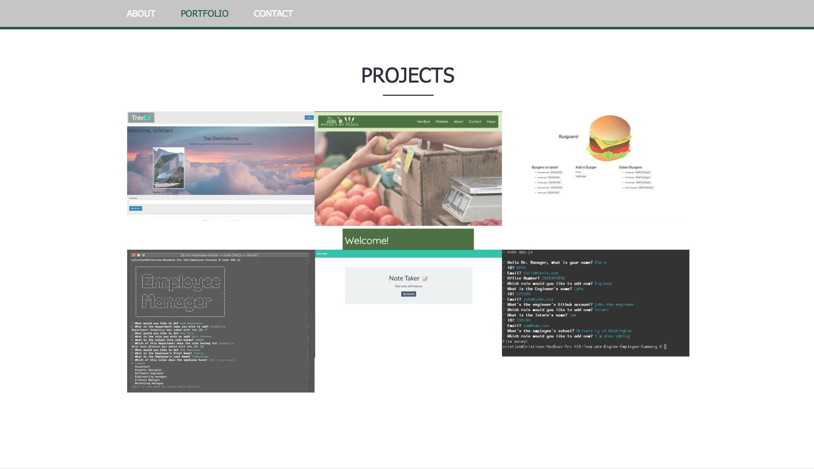

                    
# Portfolio

## Description

This Website is a showcase of my skillset, projects and accomplishments so far, doing my best at having a clean and polished UI

## Table of Contents 

* [Installation](#installation)

* [Usage](#usage)

* [License](#license)

## Installation

To install necessary dependencies, run the following command:

                        
                        'npm i or go to https://cris-portfolio.herokuapp.com'
                    
                        

## Usage

[browse through the website to see the projects that were made, about me, and contact information](https://cris-portfolio.herokuapp.com)

## License

This project is licensed under the MIT license.
  

                    